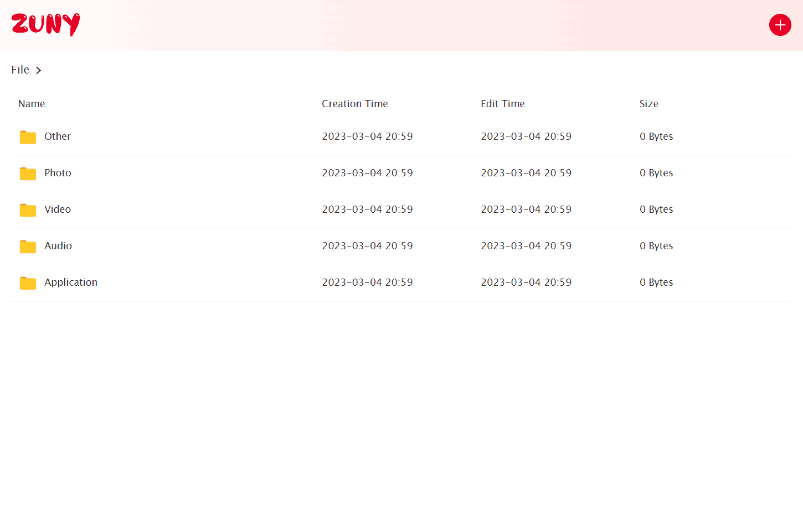

# Zuny

    
    
    

簡易文件分享系統。

## 為什麼選擇我們

* **數據可控** 檔案將儲存在您自己的伺服器上。
* **共享資料** 讓您希望分享的人看到您的檔案。
* **搜尋引擎可收錄** 每個頁面都是普通的網頁，搜尋引擎可以抓取，除非您設定了某些檔案、資料夾隱藏。
* **插件機制** 可以透過插件商城下載您需要的插件。

其他功能等待您繼續探索。

## 如何获取 Zuny

* 官方网站可直接下载。
* Github 的发布页面下载。
* 购买预装 Zuny 的设备。
* 通过我们专业的技术人员协助安装和部署。

如果您是企业、公共部门或教育用户，您可以选择 Zuny 商业版。

## 联系我们

* 社区
* Pinteger

## 加入我们

可以直接开发并向 Zuny 进行 Pull Request 贡献代码或翻译等内容到社区版，也可以加入到我们公司一起完善商业服务。

## 许可

本系统基于 [AGPL-3.0](../LICENSE) 许可。